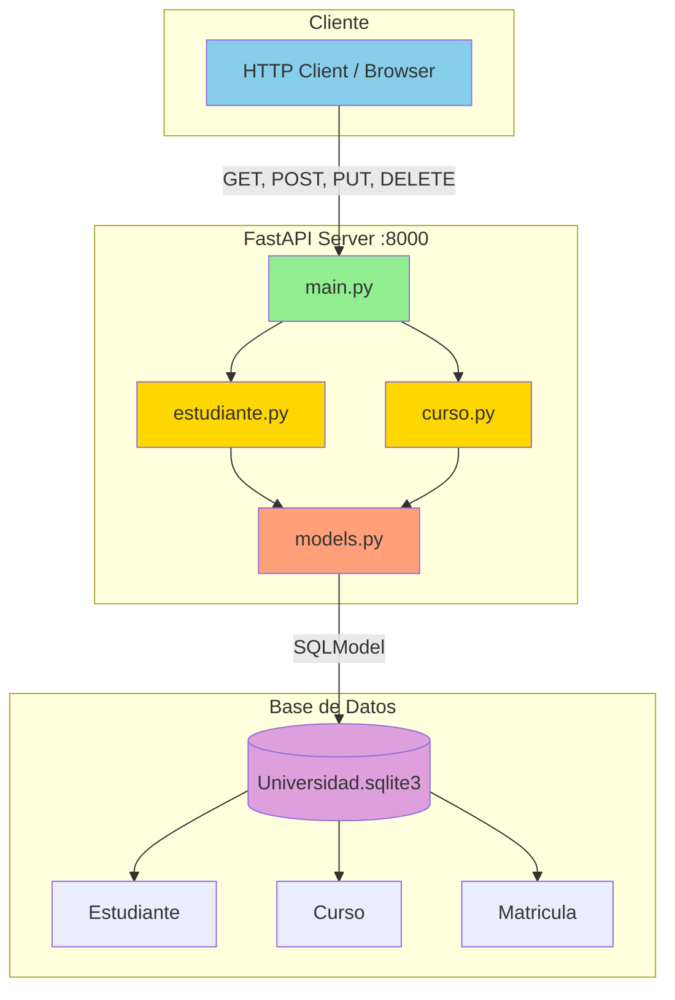
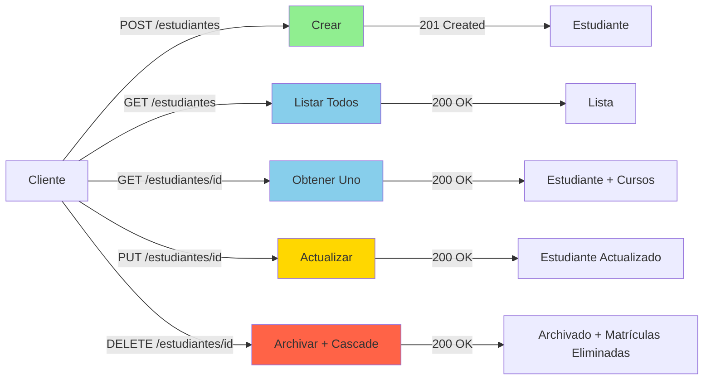
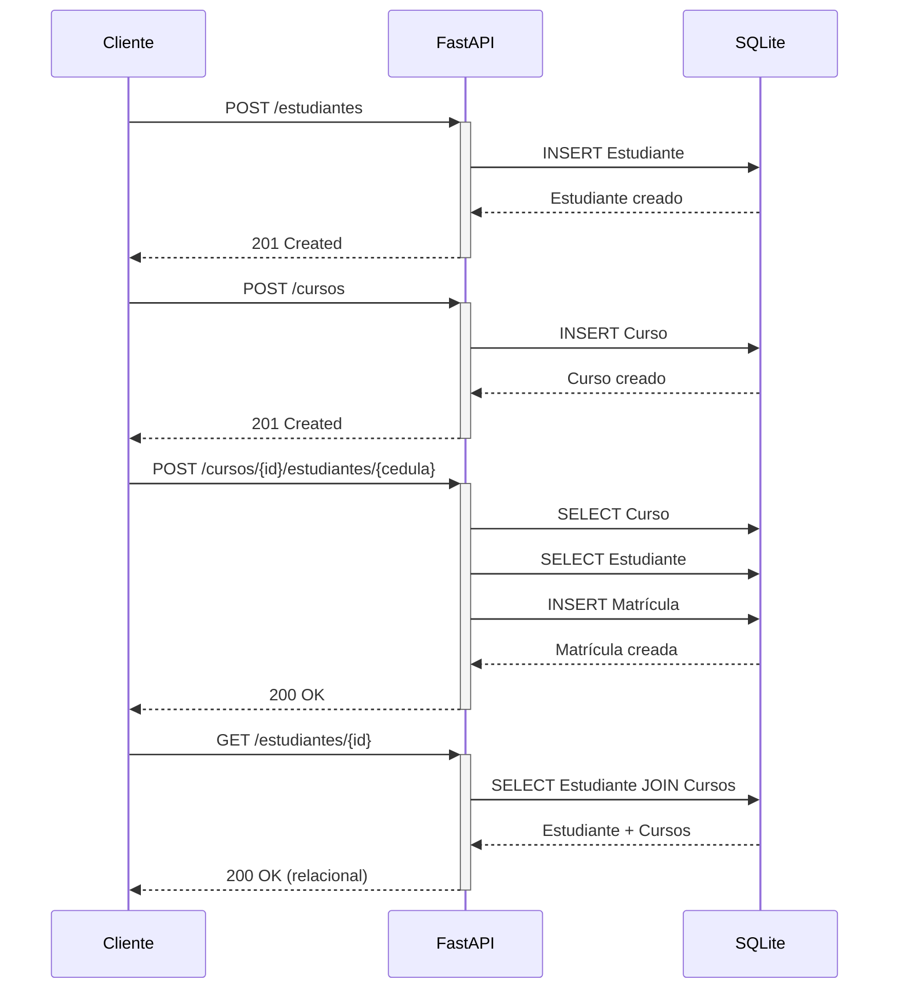
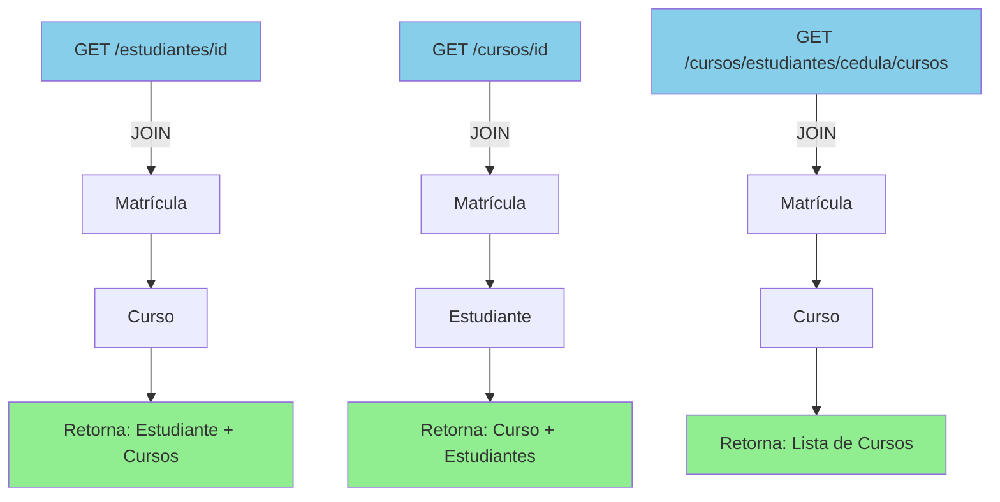

# Mapa de Endpoints - Sistema de Gestión Universitario

## Visión General

### Base URL
```
http://127.0.0.1:8000
```

### Recursos Principales
- **Estudiantes** (`/estudiantes`)
- **Cursos** (`/cursos`)
- **Matrículas** (dentro de `/cursos`)

### Arquitectura de la API



---

## Estructura de Endpoints

### Estudiantes (`/estudiantes`)

```
/estudiantes
│
├── GET    /                    → Listar todos los estudiantes
│   ├── Query: ?semestre={int}
│   └── Query: ?incluir_archivados={bool}
│
├── POST   /                    → Crear nuevo estudiante
│   └── Body: {cedula, nombre, email, semestre}
│
├── GET    /{estudiante_id}     → Obtener estudiante + cursos
│   └── Query: ?incluir_archivados={bool}
│
├── PUT    /{estudiante_id}     → Actualizar estudiante
│   └── Body: {nombre?, email?, semestre?}
│
└── DELETE /{estudiante_id}     → Archivar estudiante
    └── Elimina matrículas asociadas
```

### Cursos (`/cursos`)

```
/cursos
│
├── GET    /                              → Listar todos los cursos
│   ├── Query: ?creditos={int}
│   └── Query: ?codigo={int}
│
├── POST   /                              → Crear nuevo curso
│   └── Body: {nombre, Creditos, Horario}
│
├── GET    /{curso_id}                    → Obtener curso + estudiantes
│
├── PUT    /{curso_id}                    → Actualizar curso
│   └── Body: {nombre?, Creditos?, Horario?}
│
├── DELETE /{curso_id}                    → Eliminar curso
│   └── Elimina matrículas asociadas
│
├── POST   /{curso_id}/estudiantes/{cedula}    → Matricular
│
├── DELETE /{curso_id}/estudiantes/{cedula}    → Desmatricular
│
├── GET    /{curso_id}/estudiantes        → Listar estudiantes del curso
│
└── GET    /estudiantes/{cedula}/cursos   → Listar cursos del estudiante
```

---

## Tabla Completa de Endpoints

| Método | Endpoint | Descripción | Request Body | Códigos |
|--------|----------|-------------|--------------|---------|
| **ESTUDIANTES** |
| `GET` | `/estudiantes` | Lista estudiantes | - | 200 |
| `GET` | `/estudiantes/{id}` | Obtiene estudiante + cursos | - | 200, 404 |
| `POST` | `/estudiantes` | Crea estudiante | EstudianteCreate | 201, 409 |
| `PUT` | `/estudiantes/{id}` | Actualiza estudiante | EstudianteUpdate | 200, 400, 404 |
| `DELETE` | `/estudiantes/{id}` | Archiva estudiante | - | 200, 400, 404 |
| **CURSOS** |
| `GET` | `/cursos` | Lista cursos | - | 200 |
| `GET` | `/cursos/{id}` | Obtiene curso + estudiantes | - | 200, 404 |
| `POST` | `/cursos` | Crea curso | CursoCreate | 201 |
| `PUT` | `/cursos/{id}` | Actualiza curso | CursoUpdate | 200, 400, 404 |
| `DELETE` | `/cursos/{id}` | Elimina curso | - | 200, 404 |
| **MATRÍCULAS** |
| `POST` | `/cursos/{id}/estudiantes/{cedula}` | Matricula | - | 201, 404, 409 |
| `DELETE` | `/cursos/{id}/estudiantes/{cedula}` | Desmatricula | - | 200, 404 |
| `GET` | `/cursos/{id}/estudiantes` | Lista estudiantes | - | 200, 404 |
| `GET` | `/cursos/estudiantes/{cedula}/cursos` | Lista cursos | - | 200, 404 |

---

## Flujos de Operación

### Flujo 1: CRUD de Estudiante



### Flujo 2: Proceso de Matrícula



### Flujo 3: Consultas Relacionales



---

## Validaciones por Endpoint

### Estudiantes

| Endpoint | Validaciones |
|----------|--------------|
| `POST /estudiantes` | Cédula única (409 si existe) |
| `PUT /estudiantes/{id}` | Existe estudiante (404)<br>Al menos un campo (400) |
| `DELETE /estudiantes/{id}` | Existe estudiante (404)<br>No está archivado (400) |
| `GET /estudiantes/{id}` | Existe estudiante (404)<br>No archivado o flag activo (404) |

### Cursos

| Endpoint | Validaciones |
|----------|--------------|
| `POST /cursos` | ✅ Datos válidos |
| `PUT /cursos/{id}` | ✅ Existe curso (404)<br>✅ Al menos un campo (400) |
| `DELETE /cursos/{id}` | ✅ Existe curso (404) |
| `GET /cursos/{id}` | ✅ Existe curso (404) |

### Matrículas

| Endpoint | Validaciones |
|----------|--------------|
| `POST /cursos/{id}/estudiantes/{cedula}` | Existe curso (404)<br>Existe estudiante (404)<br>No matriculado (409) |
| `DELETE /cursos/{id}/estudiantes/{cedula}` | Existe matrícula (404) |

---

## Códigos de Estado HTTP

| Código | Nombre | Cuándo se usa |
|--------|--------|---------------|
| **200** | OK | GET, PUT, DELETE exitosos |
| **201** | Created | POST exitoso (recurso creado) |
| **400** | Bad Request | Datos inválidos o faltantes |
| **404** | Not Found | Recurso no existe |
| **409** | Conflict | Duplicado o ya matriculado |

---

## Ejemplos de Respuestas

### Estudiante Simple (GET /estudiantes)

```json
[
    {
        "cedula": 1,
        "nombre": "Kevin Rodríguez",
        "email": "kevin@universidad.edu",
        "semestre": 6,
        "archivado": false
    }
]
```

### Estudiante con Cursos (GET /estudiantes/{id})

```json
{
    "cedula": 1,
    "nombre": "Kevin Rodríguez",
    "email": "kevin@universidad.edu",
    "semestre": 6,
    "archivado": false,
    "cursos": [
        {
            "id": 1,
            "nombre": "Desarrollo de Software",
            "Creditos": 4,
            "Horario": "2025-10-30"
        }
    ]
}
```

### Curso con Estudiantes (GET /cursos/{id})

```json
{
    "id": 1,
    "nombre": "Desarrollo de Software",
    "Creditos": 4,
    "Horario": "2025-10-30",
    "estudiantes": [
        {
            "cedula": 1,
            "nombre": "Kevin Rodríguez",
            "email": "kevin@universidad.edu",
            "semestre": 6,
            "archivado": false
        }
    ]
}
```

### Respuesta de Matrícula (POST /cursos/{id}/estudiantes/{cedula})

```json
{
    "message": "matriculado",
    "curso_id": 1,
    "cedula": 1
}
```

### Respuesta de Archivar (DELETE /estudiantes/{id})

```json
{
    "message": "Estudiante archivado",
    "matriculas_eliminadas": 3
}
```

---

**Documentación:** Ver también [MODELS.md](./MODELS.md) para el diseño de modelos  
**Versión:** 1.0.0  
**Última actualización:** Octubre 30, 2025
