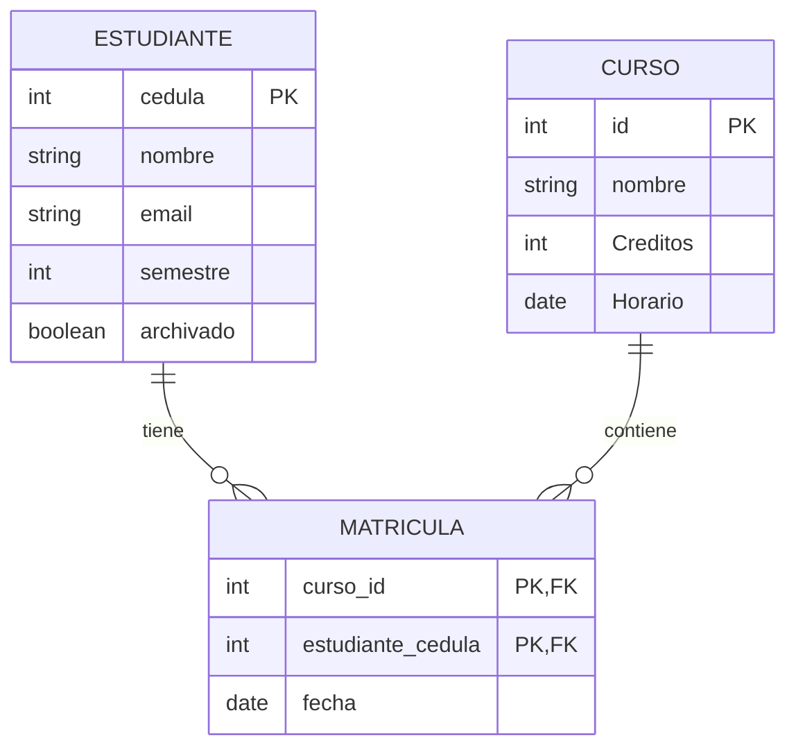
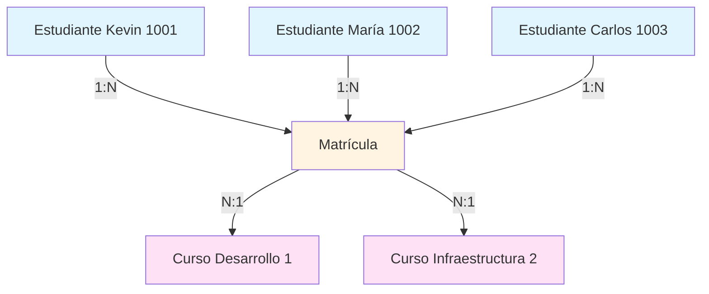
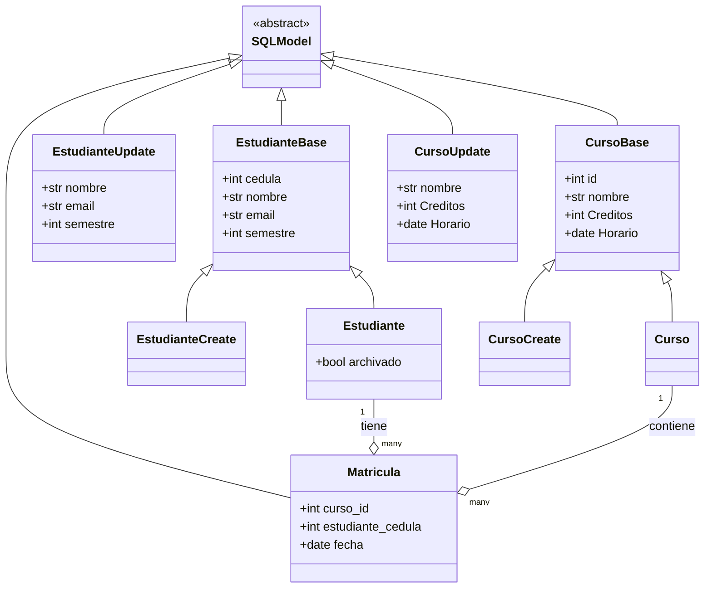

# Diseño de Modelos - Sistema de Gestión Universitario

## Diagrama Entidad-Relación (ER)



**Relación:** MUCHOS A MUCHOS (N:N)
- Un estudiante puede tener muchos cursos
- Un curso puede tener muchos estudiantes
- La tabla MATRICULA actúa como tabla intermedia

---

## Modelo 1: Estudiante

### Definición SQLModel

```python
class EstudianteBase(SQLModel):
    """Modelo base para estudiantes con campos comunes."""
    cedula: int | None = Field(default=None, primary_key=True)
    nombre: str | None = Field(description="nombre del estudiante")
    email: str | None = Field(description="email del estudiante")
    semestre: int | None = Field(description="semestre del estudiante")

class Estudiante(EstudianteBase, table=True):
    """Modelo de tabla para estudiantes."""
    archivado: bool = Field(default=False, description="indica si el estudiante está archivado")

class EstudianteCreate(EstudianteBase):
    """Esquema para crear un nuevo estudiante."""
    pass

class EstudianteUpdate(SQLModel):
    """Esquema para actualizar un estudiante (campos opcionales)."""
    nombre: str | None = None
    email: str | None = None
    semestre: int | None = None
```

### Estructura de Campos

| Campo | Tipo | Nullable | Default | Descripción |
|-------|------|----------|---------|-------------|
| `cedula` | int | No | None | Cédula única del estudiante (PK) |
| `nombre` | str | Sí | None | Nombre completo del estudiante |
| `email` | str | Sí | None | Correo electrónico institucional |
| `semestre` | int | Sí | None | Semestre académico actual (1-10) |
| `archivado` | bool | No | False | Indica si está archivado (Soft Delete) |

### Reglas de Negocio

✅ **Unicidad:** La cédula debe ser única  
✅ **Soft Delete:** No se elimina físicamente, solo se marca como archivado  
✅ **Validación:** Email debe tener formato válido  
✅ **Relaciones:** Puede tener múltiples cursos vía Matrícula  

### Ejemplo JSON

**Crear estudiante:**
```json
{
    "cedula": 1001,
    "nombre": "Kevin Rodríguez",
    "email": "kevin@universidad.edu",
    "semestre": 6
}
```

**Respuesta completa:**
```json
{
    "cedula": 1001,
    "nombre": "Kevin Rodríguez",
    "email": "kevin@universidad.edu",
    "semestre": 6,
    "archivado": false
}
```

---

## Modelo 2: Curso

### Definición SQLModel

```python
class CursoBase(SQLModel):
    """Modelo base para cursos con campos comunes."""
    id: int | None = Field(default=None, primary_key=True)
    nombre: str | None = Field(description="nombre del curso")
    Creditos: int | None = Field(description="creditos del curso")
    Horario: datetime.date | None = Field(description="horario del curso")

class Curso(CursoBase, table=True):
    """Modelo de tabla para cursos."""
    id: int | None = Field(default=None, primary_key=True)

class CursoCreate(CursoBase):
    """Esquema para crear un nuevo curso."""
    pass

class CursoUpdate(SQLModel):
    """Esquema para actualizar un curso (campos opcionales)."""
    nombre: str | None = None
    Creditos: int | None = None
    Horario: datetime.date | None = None
```

### Estructura de Campos

| Campo | Tipo | Nullable | Default | Descripción |
|-------|------|----------|---------|-------------|
| `id` | int | No | Auto | Identificador único (PK, Auto-increment) |
| `nombre` | str | Sí | None | Nombre del curso |
| `Creditos` | int | Sí | None | Cantidad de créditos (1-5) |
| `Horario` | date | Sí | None | Fecha del horario |

### Reglas de Negocio

**Auto-increment:** El ID se genera automáticamente  
**Hard Delete:** Se elimina físicamente de la BD  
**Cascada:** Al eliminar, se borran sus matrículas  
**Relaciones:** Puede tener múltiples estudiantes vía Matrícula  

### Ejemplo JSON

**Crear curso:**
```json
{
    "nombre": "Desarrollo de Software",
    "Creditos": 4,
    "Horario": "2025-10-30"
}
```

**Respuesta completa:**
```json
{
    "id": 1,
    "nombre": "Desarrollo de Software",
    "Creditos": 4,
    "Horario": "2025-10-30"
}
```

---

## Modelo 3: Matrícula (Tabla Intermedia)

### Definición SQLModel

```python
class Matricula(SQLModel, table=True):
    """Modelo de tabla para matrículas (relación muchos-a-muchos)."""
    curso_id: int | None = Field(default=None, foreign_key="curso.id", primary_key=True)
    estudiante_cedula: int | None = Field(default=None, foreign_key="estudiante.cedula", primary_key=True)
    fecha: datetime.date | None = Field(default_factory=datetime.date.today)
```

### Estructura de Campos

| Campo | Tipo | Nullable | Default | Descripción |
|-------|------|----------|---------|-------------|
| `curso_id` | int | No | None | ID del curso (FK, parte de PK) |
| `estudiante_cedula` | int | No | None | Cédula del estudiante (FK, parte de PK) |
| `fecha` | date | No | Hoy | Fecha de matrícula (auto-generada) |

### Clave Primaria Compuesta

```python
PRIMARY KEY (curso_id, estudiante_cedula)
```

Esta combinación asegura que:
- No puede haber duplicados (estudiante matriculado 2 veces en mismo curso)
- Relación única entre cada par estudiante-curso

### Reglas de Negocio

**Unicidad:** Un estudiante solo puede matricularse una vez por curso  
**Integridad:** Requiere que existan el curso y el estudiante  
**Cascada:** Se elimina al borrar estudiante o curso  
**Auto-fecha:** La fecha se genera automáticamente al crear  

### Ejemplo JSON

**Respuesta al matricular:**
```json
{
    "message": "matriculado",
    "curso_id": 1,
    "cedula": 1001
}
```

**Registro en BD:**
```json
{
    "curso_id": 1,
    "estudiante_cedula": 1001,
    "fecha": "2025-10-30"
}
```

---

## Relaciones y Cardinalidad

### Estudiante ↔ Curso (N:N)



**Ejemplo práctico:**
- Kevin (estudiante 1001) está matriculado en:
  - Desarrollo de Software (curso 1)
  - Infraestructura de TI (curso 2)
  
- Desarrollo de Software (curso 1) tiene:
  - Kevin (estudiante 1001)
  - María (estudiante 1002)
  - Carlos (estudiante 1003)

### Tabla de Matrículas Resultante

| curso_id | estudiante_cedula | fecha |
|----------|-------------------|-------|
| 1 | 1001 | 2025-10-30 |
| 2 | 1001 | 2025-10-30 |
| 1 | 1002 | 2025-10-30 |
| 1 | 1003 | 2025-10-30 |

---

## Integridad Referencial

### Claves Foráneas (Foreign Keys)

```python
# En Matrícula:
curso_id → curso.id
estudiante_cedula → estudiante.cedula
```

### Operaciones en Cascada

**Al archivar estudiante:**
```python
# 1. Buscar matrículas del estudiante
matriculas = session.query(Matricula).filter(
    Matricula.estudiante_cedula == cedula
).all()

# 2. Eliminar todas las matrículas
for matricula in matriculas:
    session.delete(matricula)

# 3. Marcar estudiante como archivado
estudiante.archivado = True
session.commit()
```

**Al eliminar curso:**
```python
# 1. Buscar matrículas del curso
matriculas = session.query(Matricula).filter(
    Matricula.curso_id == curso_id
).all()

# 2. Eliminar todas las matrículas
for matricula in matriculas:
    session.delete(matricula)

# 3. Eliminar el curso
session.delete(curso)
session.commit()
```

---

## Diagrama de Clases SQLModel



---

## Validaciones de Modelos

### Pydantic Validation (Automática)

SQLModel usa Pydantic internamente para validar:

**Tipos de datos:** int, str, date  
**Campos requeridos:** No permite None en campos obligatorios  
**Formato de email:** Valida sintaxis de email  
**Rangos:** Puede validar rangos de valores  

### Validaciones Custom

```python
# Validación de semestre (1-10)
@validator('semestre')
def validate_semestre(cls, v):
    if v < 1 or v > 10:
        raise ValueError('Semestre debe estar entre 1 y 10')
    return v

# Validación de créditos (1-5)
@validator('Creditos')
def validate_creditos(cls, v):
    if v < 1 or v > 5:
        raise ValueError('Créditos debe estar entre 1 y 5')
    return v
```

---

## Esquema de Base de Datos SQLite

### Tabla: estudiante

```sql
CREATE TABLE estudiante (
    cedula INTEGER PRIMARY KEY,
    nombre TEXT,
    email TEXT,
    semestre INTEGER,
    archivado BOOLEAN DEFAULT 0
);
```

### Tabla: curso

```sql
CREATE TABLE curso (
    id INTEGER PRIMARY KEY AUTOINCREMENT,
    nombre TEXT,
    Creditos INTEGER,
    Horario DATE
);
```

### Tabla: matricula

```sql
CREATE TABLE matricula (
    curso_id INTEGER,
    estudiante_cedula INTEGER,
    fecha DATE DEFAULT CURRENT_DATE,
    PRIMARY KEY (curso_id, estudiante_cedula),
    FOREIGN KEY (curso_id) REFERENCES curso(id),
    FOREIGN KEY (estudiante_cedula) REFERENCES estudiante(cedula)
);
```

---

## Índices

SQLite crea automáticamente índices para:

- Claves primarias (PK)
- Claves foráneas (FK)
- Constraints UNIQUE

**Índices automáticos:**
```
estudiante.cedula (PK) → Index
curso.id (PK) → Index
matricula.(curso_id, estudiante_cedula) (PK compuesta) → Index
```

---

**Documentación:** Ver también [ENDPOINTS.md](./ENDPOINTS.md) para el mapa de endpoints  
**Versión:** 1.0.0  
**Última actualización:** Octubre 30, 2025
